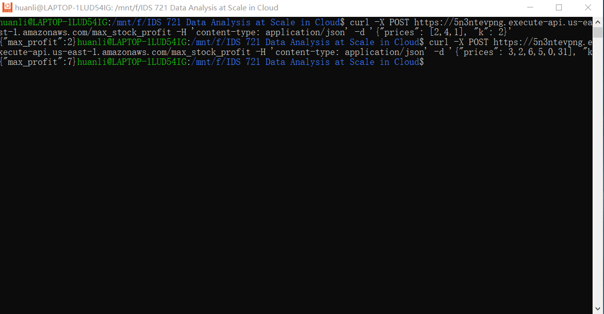
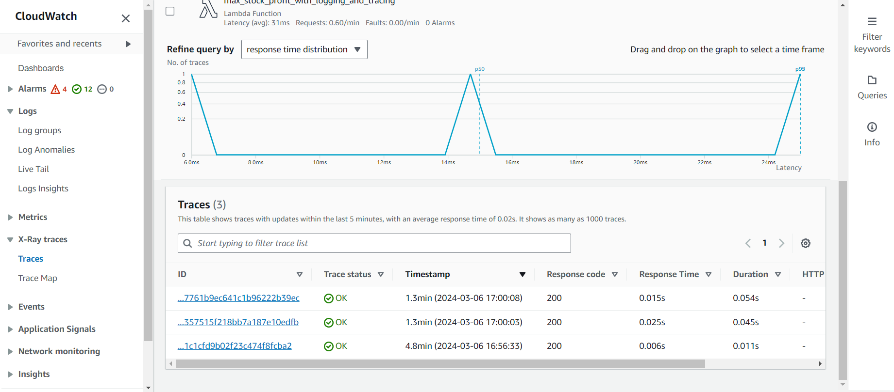
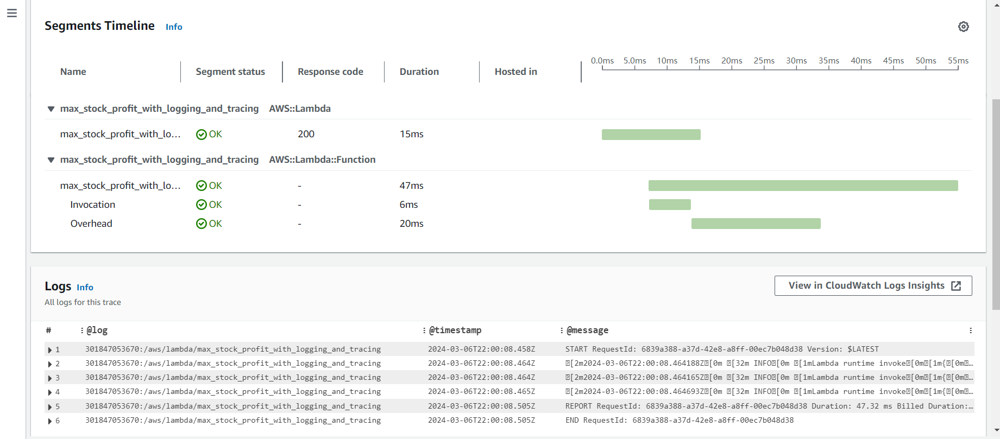

# Lambda Function for Best Time to Buy and Sell Stock with Logging and Tracing

This project showcases how to improve observability in serverless applications by incorporating logging and tracing in a Rust-based AWS Lambda function. The primary purpose of this Lambda function is to find the maximum profit you can achieve given an integer array prices where prices[i] is the price of a given stock on the ith day, and an integer k, which is the max times of transactions. For detailed, structured logging, it utilizes the tracing and tracing-subscriber crates, and for in-depth tracing of function executions, it integrates with AWS X-Ray. This setup ensures a thorough analysis of the function's execution and performance. Additionally, with the help of AWS CloudWatch, it enables all logs and traces.

Users can remotely configure the invocation request to trigger the function:
```
 cargo lambda invoke --remote max_stock_profit_with_logging_and_tracing --data-ascii "{"prices": [3,2,6,5,0,3], "k": 2}"
```
or directly trigger the function using the API URL:
```
curl -X POST https://5n3ntevpng.execute-api.us-east-1.amazonaws.com/max_stock_profit -H 'content-type: application/json' -d '{"prices": [3,2,6,5,0,3], "k": 2}'
```
## Goals
* Add logging to a Rust Lambda function
* Integrate AWS X-Ray tracing
* Connect logs/traces to CloudWatch

## Steps
### Step 1: Initialize Rust Project
* Begin by initializing your Cargo Lambda project using the command `cargo lambda new <YOUR-PROJECT-NAME>`. 
* Include "tracing", "tracing-subscriber", and other essential dependencies in the `Cargo.toml` file. Modify the `src/main.rs` file according to your design and requirements.
* Navigate to the project directory, locally test the functionality by running the command `cargo lambda watch`.

### Step 2: AWS Setup
* Navigate to the AWS IAM Management Console to create a new IAM User for credential management.
* Attach policies `LambdaFullAccess`, `IAMFullAccess`, and `AWSXrayFullAccess`.
* Under `Security Sredentials` section, generate an access key for API access. Make sure the key is safely stored and not lost.
* Set up your environment variables so that cargo lambda knows which AWS account and region to deploy to. 
```
export AWS_ACCESS_KEY_ID="your_access_key_here"
export AWS_SECRET_ACCESS_KEY="your_secret_key_here"
export AWS_DEFAULT_REGION="your_preferred_region_here"
```
* Build the project by running `cargo lambda build --release`.
* Deploy the project by running `cargo lambda deploy`.

### Step 3: Logging and Tracing
* Go to AWS console and enter AWS Lambda, navigate into your lambda function. Then under `Configuration`, click `Monitoring and operations tools`. 
* In the `Additional monitoring tools` panel, click `edit` to enable `AWS X-Ray Active tracing` and `Lambda Insights Enhanced monitoring`.
* Test remote invoke and go to `Monitor` tab to view X-Ray traces.

### Step 4: API Configuration
* Initiate a new API setup, opting for the default REST API option, and then create a new resource for your API's endpoint.
* For the created resource, implement an `ANY` method and associate it with your Lambda function.
* Launch your API by creating a new deployment stage.
* Click deploy, find `stages` and find your invoke URL.
* You can test your API gateway using `curl` request:
```
curl -X POST https://5n3ntevpng.execute-api.us-east-1.amazonaws.com/max_stock_profit -H 'content-type: application/json' -d '{"prices": [3,2,6,5,0,3], "k": 2}'
```

### Step 5: Gitlab Deploy
* After the success of test, set your `AWS_ACCESS_KEY_ID`, `AWS_SECRET_ACCESS_KEY`, and `AWS_REGION` to gitlab `Settings -> CI/CD -> Variables`.
* Use `.gitlab-ci.yml` and `makefile` to enable auto build, test, and deploy of the lambda function.

## Screenshots
* Curl request

* CloudWatch & AWS X-Ray Tracing

* Trace-level Loggings



